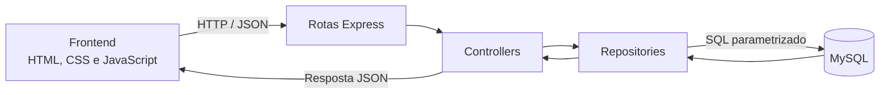
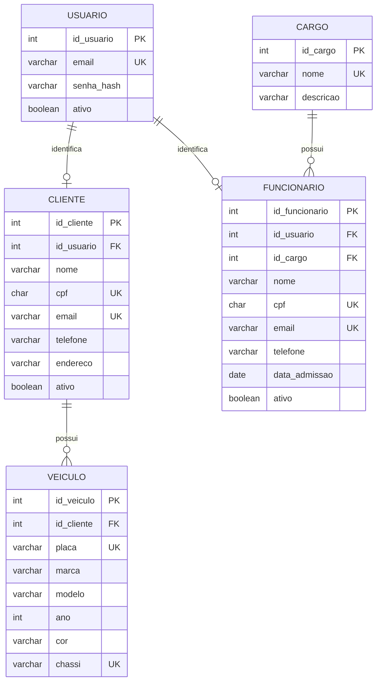

<div align="center">

# 🔧 OficinaDS

### Sistema web de gerenciamento para oficinas mecânicas

Projeto acadêmico desenvolvido para centralizar o atendimento, os clientes, os funcionários e as operações de uma oficina mecânica.


</div>

## Sobre o projeto

O **OficinaDS** é um sistema web criado para organizar informações e processos de uma oficina mecânica em um único ambiente.

O projeto completo prevê funcionalidades como autenticação, controle de permissões, clientes, veículos, funcionários, agendamentos, ordens de serviço, diagnósticos, orçamentos, estoque, financeiro e relatórios.

Histórias:

| História | Funcionalidade | Situação |
| --- | --- | :---: |
| **DM-67** | Consultar clientes | ✅ Implementada |
| **DM-100** | Pesquisar funcionários | ✅ Implementada |

> O sistema está em desenvolvimento. As funcionalidades marcadas como planejadas no roadmap ainda serão integradas pelo grupo.

## Funcionalidades implementadas

### DM-67 — Consultar clientes

- listagem de clientes em ordem alfabética;
- paginação dos resultados;
- exibição de CPF, e-mail, telefone e status;
- quantidade de veículos por cliente;
- consulta detalhada de um cliente;
- visualização dos veículos vinculados;
- tratamento para cliente sem veículo;
- estados de carregamento, lista vazia e erro.

### DM-100 — Pesquisar funcionários

- listagem inicial de funcionários;
- pesquisa por nome;
- pesquisa por CPF, inclusive digitado com pontuação;
- pesquisa por e-mail;
- pesquisa por cargo;
- filtro de funcionários ativos e inativos;
- paginação dos resultados;
- mensagem quando não existem correspondências.

### Recursos gerais

- interface responsiva para computadores e dispositivos móveis;
- identidade visual inspirada no protótipo do Figma;
- API REST com respostas em JSON;
- consultas parametrizadas contra SQL Injection;
- validação de parâmetros da API;
- tratamento centralizado de erros;
- configurações sensíveis separadas em variáveis de ambiente;
- testes automatizados com o test runner nativo do Node.js.

## Tecnologias

| Camada | Tecnologias |
| --- | --- |
| Frontend | HTML5, CSS3 e JavaScript |
| Backend | Node.js e Express |
| Banco de dados | MySQL |
| Comunicação | API REST e JSON |
| Segurança | Helmet, variáveis de ambiente e consultas parametrizadas |
| Desenvolvimento | VS Code, Nodemon e MySQL Workbench |
| Versionamento | Git e GitHub |

## Arquitetura

O projeto separa apresentação, regras HTTP e acesso a dados para facilitar a integração entre os integrantes da equipe.



### Responsabilidade de cada camada

- **Frontend:** apresenta as telas e recebe as ações do usuário.
- **Routes:** relacionam os endereços da API aos controllers.
- **Controllers:** validam os parâmetros e montam as respostas HTTP.
- **Repositories:** concentram as consultas ao MySQL.
- **Middlewares:** tratam erros e comportamentos compartilhados.
- **Banco:** armazena os dados de forma persistente.

## Estrutura do projeto

```text
OficinaDS/
├── database/
│   ├── 01_schema.sql
│   ├── 02_dados_teste.sql
│   ├── 03_usuario_aplicacao.sql
│   └── 04_consultas_para_estudar.sql
├── docs/
│   ├── DER_DO_MODULO.md
│   ├── INTEGRACAO_EQUIPE.md
│   └── SUBTAREFAS_E_ACEITE.md
├── public/
│   ├── assets/
│   │   ├── css/
│   │   └── js/
│   ├── clientes.html
│   ├── funcionarios.html
│   └── index.html
├── src/
│   ├── config/
│   ├── controllers/
│   ├── middlewares/
│   ├── repositories/
│   ├── routes/
│   ├── utils/
│   ├── app.js
│   └── server.js
├── test/
├── .env.example
├── .gitignore
├── package.json
└── README.md
```

## Modelo de dados deste módulo

As histórias atuais utilizam o seguinte recorte do DER geral:



O DER completo e as observações sobre as relações estão em [`docs/DER_DO_MODULO.md`](docs/DER_DO_MODULO.md).

## Pré-requisitos

Antes de executar o projeto, instale:

- [Node.js](https://nodejs.org/) 20 ou mais recente;
- [MySQL Community Server](https://dev.mysql.com/downloads/mysql/) 8 ou mais recente;
- [MySQL Workbench](https://dev.mysql.com/downloads/workbench/);
- [Git](https://git-scm.com/);
- um editor, como o [Visual Studio Code](https://code.visualstudio.com/).

## Como executar

### 1. Obtenha o projeto

Clone o repositório pelo endereço disponibilizado no botão **Code** do GitHub:

```bash
git clone URL_DO_REPOSITORIO
cd OficinaDS
```

Também é possível baixar o projeto como ZIP e abrir a pasta no VS Code.

### 2. Instale as dependências

```bash
npm install
```

### 3. Prepare o banco de dados

Abra o MySQL Workbench, conecte-se ao servidor local e execute os arquivos da pasta `database` nesta ordem:

1. `01_schema.sql` — cria o banco e as tabelas;
2. `02_dados_teste.sql` — adiciona dados fictícios;
3. `03_usuario_aplicacao.sql` — cria o usuário local usado pela aplicação.

O arquivo `04_consultas_para_estudar.sql` é opcional e contém exemplos de consultas.

### 4. Configure as variáveis de ambiente

Crie o arquivo `.env` a partir do modelo.

No Prompt de Comando do Windows:

```cmd
copy .env.example .env
```

No PowerShell:

```powershell
Copy-Item .env.example .env
```

No Linux ou macOS:

```bash
cp .env.example .env
```

Estrutura esperada:

```dotenv
PORT=3000
DB_HOST=localhost
DB_PORT=3306
DB_USER=oficina_app
DB_PASSWORD=sua_senha_local
DB_NAME=oficina_ds
DB_CONNECTION_LIMIT=10
```

O valor de `DB_PASSWORD` deve ser igual ao definido em `database/03_usuario_aplicacao.sql`.

> Nunca envie o arquivo `.env` ao GitHub. Somente o `.env.example` deve ser versionado.

### 5. Inicie o sistema

Modo de desenvolvimento:

```bash
npm run dev
```

Modo normal:

```bash
npm start
```

Depois, acesse:

- página inicial: [http://localhost:3000](http://localhost:3000);
- clientes: [http://localhost:3000/clientes.html](http://localhost:3000/clientes.html);
- funcionários: [http://localhost:3000/funcionarios.html](http://localhost:3000/funcionarios.html).

## API

| Método | Endpoint | Descrição |
| --- | --- | --- |
| `GET` | `/api/saude` | Verifica se o servidor está funcionando |
| `GET` | `/api/clientes` | Lista os clientes com paginação |
| `GET` | `/api/clientes/:id` | Consulta um cliente e seus veículos |
| `GET` | `/api/funcionarios` | Pesquisa e filtra funcionários |

### Parâmetros da listagem de clientes

```http
GET /api/clientes?pagina=1&limite=8
```

### Parâmetros da pesquisa de funcionários

```http
GET /api/funcionarios?busca=mecanico&status=ativos&pagina=1&limite=8
```

| Parâmetro | Valores | Padrão |
| --- | --- | --- |
| `busca` | nome, CPF, e-mail ou cargo | vazio |
| `status` | `todos`, `ativos` ou `inativos` | `todos` |
| `pagina` | inteiro positivo | `1` |
| `limite` | inteiro entre 1 e 50 | `8` |

## Testes

Execute os testes automatizados:

```bash
npm test
```

Verifique também a sintaxe dos principais arquivos JavaScript:

```bash
npm run check
```

O projeto possui testes para:

- servidor HTTP e rota de saúde;
- rotas inexistentes;
- entrega dos arquivos do frontend;
- paginação;
- validação de identificadores;
- filtros de funcionários;
- cálculo do total de páginas.

## Integração da equipe

Para evitar conflitos entre as histórias:

- utilize uma branch por funcionalidade;
- não envie `node_modules` ou `.env` ao repositório;
- mantenha os nomes das tabelas e colunas definidos no DER central;
- preserve o formato combinado das respostas JSON;
- use a conexão MySQL compartilhada do projeto;
- execute os testes antes de abrir um pull request;
- confirme que as funcionalidades anteriores continuam funcionando após o merge.

Mais detalhes estão em [`docs/INTEGRACAO_EQUIPE.md`](docs/INTEGRACAO_EQUIPE.md).

## Roadmap

- [x] Consultar clientes;
- [x] visualizar detalhes e veículos do cliente;
- [x] pesquisar funcionários;
- [x] filtrar funcionários por status;
- [ ] cadastro e login de usuários;
- [ ] controle de perfis e permissões;
- [ ] administração de funcionários;
- [ ] cadastro de clientes e veículos;
- [ ] agendamentos e controle de urgência;
- [ ] ordens de serviço e histórico de status;
- [ ] diagnósticos e registro de danos;
- [ ] orçamentos e aprovação do cliente;
- [ ] controle e solicitação de peças;
- [ ] controle financeiro;
- [ ] avaliações, presença e relatórios.

## Boas práticas adotadas

- senhas e configurações locais não ficam no repositório;
- consultas utilizam parâmetros em vez de concatenar entradas do usuário;
- o usuário MySQL da aplicação possui apenas permissão de leitura neste módulo;
- dados de demonstração são fictícios e utilizam o domínio reservado `.test`;
- erros internos não são expostos diretamente ao navegador;
- frontend e backend seguem contratos documentados.

## Equipe

Desenvolvido em equipe como projeto acadêmico de Engenharia de Software e Desenvolvimento Web.

## Situação do projeto

O OficinaDS está em construção e será ampliado ao longo das próximas sprints. Sugestões, correções e novas funcionalidades devem ser discutidas pela equipe antes da integração ao branch principal.

