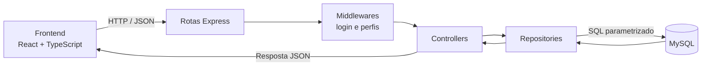
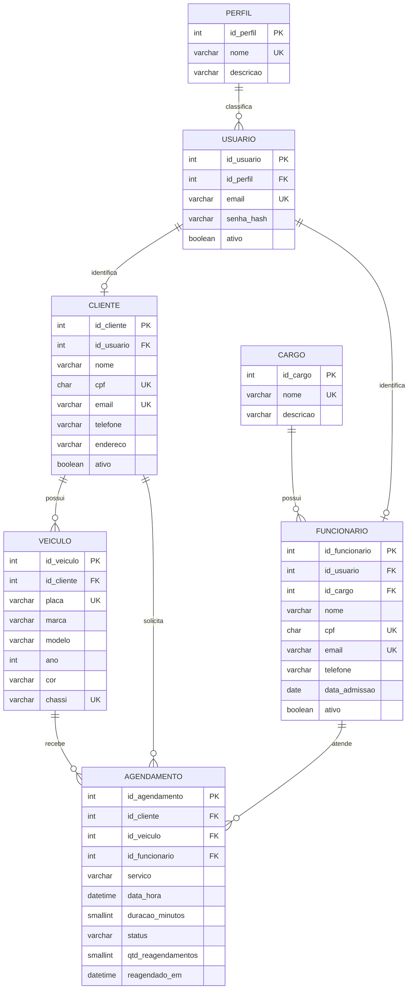

<div align="center">

# 🔧 OficinaDS

### Sistema web de gerenciamento para oficinas mecânicas

Projeto acadêmico desenvolvido para centralizar o atendimento, os clientes, os funcionários e as operações de uma oficina mecânica.


</div>

## Sobre o projeto

O **OficinaDS** é um sistema web criado para organizar informações e processos de uma oficina mecânica em um único ambiente.

O projeto completo prevê funcionalidades como autenticação, controle de permissões, clientes, veículos, funcionários, agendamentos, ordens de serviço, diagnósticos, orçamentos, estoque, financeiro e relatórios.

Histórias:

| História | Funcionalidade | Situação |
| --- | --- | :---: |
| **DM-67** | Consultar clientes | ✅ Implementada |
| **DM-100** | Pesquisar funcionários | ✅ Implementada |
| **DM-180** | Registrar diagnóstico | ✅ Implementada |
| — | Cadastro, login e perfis de acesso | ✅ Implementada |
| — | Reagendar serviço | ✅ Implementada |

> O sistema está em desenvolvimento. As funcionalidades marcadas como planejadas no roadmap ainda serão integradas pelo grupo.

## Funcionalidades implementadas

### DM-67 — Consultar clientes

- listagem de clientes em ordem alfabética;
- paginação dos resultados;
- exibição de CPF, e-mail, telefone e status;
- quantidade de veículos por cliente;
- consulta detalhada de um cliente;
- visualização dos veículos vinculados;
- tratamento para cliente sem veículo;
- estados de carregamento, lista vazia e erro.

### DM-100 — Pesquisar funcionários

- listagem inicial de funcionários;
- pesquisa por nome;
- pesquisa por CPF, inclusive digitado com pontuação;
- pesquisa por e-mail;
- pesquisa por cargo;
- filtro de funcionários ativos e inativos;
- alteração do cargo de um funcionário;
- paginação dos resultados;
- mensagem quando não existem correspondências.

### DM-180 — Registrar diagnóstico

- listagem dos diagnósticos com ordem de serviço, veículo, cliente e responsável;
- registro de um novo diagnóstico;
- edição e exclusão de diagnósticos.

### Cadastro, login e perfis de acesso

- cadastro e login com senha criptografada e token JWT;
- três perfis: **Administrador**, **Funcionario** e **Cliente**;
- menu e rotas da tela adaptados ao perfil;
- bloqueio no backend (HTTP 401 sem login e 403 sem permissão);
- listagem de usuários e resumo financeiro para o Administrador.

### Reagendamento de serviços

- listagem de agendamentos com status;
- criação de um novo agendamento;
- reagendamento de data e horário;
- consulta dos horários disponíveis;
- validação de status permitido, antecedência mínima, expediente e conflitos de horário (profissional, veículo e capacidade da oficina).

As regras e a API estão descritas em [`docs/REAGENDAMENTO.md`](docs/REAGENDAMENTO.md).

### Recursos gerais

- interface responsiva para computadores e dispositivos móveis;
- identidade visual inspirada no protótipo do Figma;
- API REST com respostas em JSON;
- consultas parametrizadas contra SQL Injection;
- validação de parâmetros da API;
- tratamento centralizado de erros;
- configurações sensíveis separadas em variáveis de ambiente;
- testes automatizados com o test runner nativo do Node.js.

## Perfis e permissões

| Área | Administrador | Funcionario | Cliente |
| --- | :---: | :---: | :---: |
| Início | ✅ | ✅ | ✅ |
| Clientes | ✅ | ✅ | ❌ |
| Diagnósticos | ✅ | ✅ | ❌ |
| Agendamentos | ✅ | ✅ | ❌ |
| Funcionários | ✅ | ❌ | ❌ |
| Usuários | ✅ | ❌ | ❌ |
| Financeiro | ✅ | ❌ | ❌ |

Quem se cadastra pela tela de cadastro nasce como **Funcionario**. Para promover alguém a Administrador, altere o perfil no banco (veja [Criar usuários de teste](#criar-usuários-de-teste)). O portal do **Cliente** ainda não existe.

## Tecnologias

| Camada | Tecnologias |
| --- | --- |
| Frontend | React, TypeScript e Vite |
| Backend | Node.js e Express |
| Banco de dados | MySQL |
| Comunicação | API REST e JSON |
| Segurança | JWT, bcrypt, Helmet, variáveis de ambiente e consultas parametrizadas |
| Desenvolvimento | VS Code, Nodemon e MySQL Workbench |
| Versionamento | Git e GitHub |

## Arquitetura

O projeto separa apresentação, regras HTTP e acesso a dados para facilitar a integração entre os integrantes da equipe.


```mermaid
flowchart LR
    A[Frontend<br/>React + TypeScript] -->|HTTP / JSON| B[Rotas Express]
    B --> M[Middlewares<br/>login e perfis]
    M --> C[Controllers]
    C --> D[Repositories]
    D -->|SQL parametrizado| E[(MySQL)]
    E --> D
    D --> C
    C -->|Resposta JSON| A
```

### Responsabilidade de cada camada

- **Frontend:** apresenta as telas e recebe as ações do usuário.
- **Routes:** relacionam os endereços da API aos controllers e definem quais perfis têm acesso.
- **Middlewares:** verificam o login, carregam o perfil, validam a permissão e tratam erros.
- **Controllers:** validam os parâmetros, aplicam as regras e montam as respostas HTTP.
- **Repositories:** concentram as consultas ao MySQL.
- **Utils:** funções de apoio e regras puras, como as de agendamento em `src/utils/regrasAgendamento.js`.
- **Banco:** armazena os dados de forma persistente.

## Estrutura do projeto

```text
OficinaDS/
├── database/
│   ├── 01_schema.sql
│   ├── 02_dados_teste.sql
│   ├── 03_usuario_aplicacao.sql
│   ├── 04_consultas_para_estudar.sql
│   ├── 05_perfis.sql
│   ├── 06_associacao_usuario_perfil.sql
│   ├── 07_perfil_cliente.sql
│   ├── 13_diagnosticos.sql
│   └── 15_agendamentos.sql
├── docs/
│   ├── DER_DO_MODULO.md
│   ├── INTEGRACAO_EQUIPE.md
│   ├── REAGENDAMENTO.md
│   └── SUBTAREFAS_E_ACEITE.md
├── frontend/
│   ├── public/
│   ├── src/
│   │   ├── components/
│   │   ├── context/
│   │   ├── pages/
│   │   ├── services/
│   │   ├── styles/
│   │   ├── types/
│   │   ├── utils/
│   │   └── App.tsx
│   ├── index.html
│   ├── package.json
│   └── vite.config.ts
├── src/
│   ├── config/
│   ├── controllers/
│   ├── middlewares/
│   ├── repositories/
│   ├── routes/
│   ├── utils/
│   ├── app.js
│   └── server.js
├── test/
├── .env.example
├── .gitignore
├── package.json
└── README.md
```

## Modelo de dados

O recorte do DER geral usado pelas funcionalidades atuais:


```mermaid
erDiagram
    PERFIL ||--o{ USUARIO : classifica
    USUARIO ||--o| CLIENTE : identifica
    USUARIO ||--o| FUNCIONARIO : identifica
    CARGO ||--o{ FUNCIONARIO : possui
    CLIENTE ||--o{ VEICULO : possui
    VEICULO ||--o{ AGENDAMENTO : recebe
    FUNCIONARIO ||--o{ AGENDAMENTO : atende
    CLIENTE ||--o{ AGENDAMENTO : solicita

    PERFIL {
        int id_perfil PK
        varchar nome UK
        varchar descricao
    }

    USUARIO {
        int id_usuario PK
        int id_perfil FK
        varchar email UK
        varchar senha_hash
        boolean ativo
    }

    CLIENTE {
        int id_cliente PK
        int id_usuario FK
        varchar nome
        char cpf UK
        varchar email UK
        varchar telefone
        varchar endereco
        boolean ativo
    }

    VEICULO {
        int id_veiculo PK
        int id_cliente FK
        varchar placa UK
        varchar marca
        varchar modelo
        int ano
        varchar cor
        varchar chassi UK
    }

    CARGO {
        int id_cargo PK
        varchar nome UK
        varchar descricao
    }

    FUNCIONARIO {
        int id_funcionario PK
        int id_usuario FK
        int id_cargo FK
        varchar nome
        char cpf UK
        varchar email UK
        varchar telefone
        date data_admissao
        boolean ativo
    }

    AGENDAMENTO {
        int id_agendamento PK
        int id_cliente FK
        int id_veiculo FK
        int id_funcionario FK
        varchar servico
        datetime data_hora
        smallint duracao_minutos
        varchar status
        smallint qtd_reagendamentos
        datetime reagendado_em
    }
```

O DER completo e as observações sobre as relações estão em [`docs/DER_DO_MODULO.md`](docs/DER_DO_MODULO.md). As tabelas de ordem de serviço e diagnóstico são criadas pelo script `13_diagnosticos.sql`.

## Pré-requisitos

Antes de executar o projeto, instale:

- [Node.js](https://nodejs.org/) 20 ou mais recente;
- [MySQL Community Server](https://dev.mysql.com/downloads/mysql/) 8 ou mais recente;
- [MySQL Workbench](https://dev.mysql.com/downloads/workbench/) (opcional, se preferir não usar o terminal);
- [Git](https://git-scm.com/);
- um editor, como o [Visual Studio Code](https://code.visualstudio.com/).

## Como executar

### 1. Obtenha o projeto

Clone o repositório pelo endereço disponibilizado no botão **Code** do GitHub:

```bash
git clone URL_DO_REPOSITORIO
cd OficinaDS
```

Também é possível baixar o projeto como ZIP e abrir a pasta no VS Code.

### 2. Instale as dependências

Na raiz do projeto (backend) e na pasta `frontend`:

```bash
npm install
cd frontend
npm install
cd ..
```

### 3. Prepare o banco de dados

Execute os arquivos da pasta `database` como `root`, **nesta ordem** (a ordem importa):

1. `01_schema.sql`: cria o banco e as tabelas;
2. `02_dados_teste.sql`: adiciona dados fictícios;
3. `05_perfis.sql`: cria os perfis de acesso;
4. `06_associacao_usuario_perfil.sql`: liga cada usuário a um perfil;
5. `07_perfil_cliente.sql`: adiciona o perfil Cliente;
6. `03_usuario_aplicacao.sql`: cria o usuário usado pela aplicação (precisa rodar **depois** do `06`, porque dá permissão em `usuario.id_perfil`);
7. `13_diagnosticos.sql`: ordens de serviço e diagnósticos;
8. `15_agendamentos.sql`: agendamentos e reagendamento.

4. `05_perfis.sql` a `12_cadastro_clientes_e_atendimento.sql` — perfis, permissões, atendimentos/orçamentos e cadastro de clientes (executar em ordem, como root).

O arquivo `04_consultas_para_estudar.sql` é opcional e contém exemplos de consultas.

Pelo terminal:

```bash
mysql -u root -p --default-character-set=utf8mb4 < database/01_schema.sql
mysql -u root -p --default-character-set=utf8mb4 < database/02_dados_teste.sql
mysql -u root -p --default-character-set=utf8mb4 < database/05_perfis.sql
mysql -u root -p --default-character-set=utf8mb4 < database/06_associacao_usuario_perfil.sql
mysql -u root -p --default-character-set=utf8mb4 < database/07_perfil_cliente.sql
mysql -u root -p --default-character-set=utf8mb4 < database/03_usuario_aplicacao.sql
mysql -u root -p --default-character-set=utf8mb4 < database/13_diagnosticos.sql
mysql -u root -p --default-character-set=utf8mb4 < database/15_agendamentos.sql
```

> No Windows, o `--default-character-set=utf8mb4` evita erros de codificação e acentos quebrados. Execute cada script **uma única vez**: alguns (como o `06`) falham se forem repetidos. Para recomeçar, apague o banco com `DROP DATABASE oficina_ds;` e refaça a sequência.

Confira se os perfis foram criados:

```bash
mysql -u root -p oficina_ds -e "SELECT * FROM perfil;"
```

### 4. Configure as variáveis de ambiente

Crie o arquivo `.env` a partir do modelo.

No Prompt de Comando do Windows:

```cmd
copy .env.example .env
```

No PowerShell:

```powershell
Copy-Item .env.example .env
```

No Linux, macOS ou Git Bash:

```bash
cp .env.example .env
```

Estrutura esperada:

```dotenv
PORT=3000
JWT_SECRET=troque-por-um-texto-secreto
DB_HOST=localhost
DB_PORT=3306
DB_USER=oficina_app
DB_PASSWORD=TroqueEstaSenha123!
DB_NAME=oficina_ds
DB_CONNECTION_LIMIT=10
```

O valor de `DB_PASSWORD` deve ser igual ao definido em `database/03_usuario_aplicacao.sql`.

> Nunca envie o arquivo `.env` ao GitHub. Somente o `.env.example` deve ser versionado.

### 5. Inicie o sistema

São dois terminais abertos ao mesmo tempo.

**Terminal 1 — backend (porta 3000):**

```bash
npm run dev
```

Deve aparecer `✓ Conexão com o MySQL estabelecida.`. Para testar:

```bash
curl http://localhost:3000/api/saude
```

**Terminal 2 — frontend (porta 5173):**

```bash
cd frontend
npm run dev
```

Depois, acesse [http://localhost:5173](http://localhost:5173). O Vite encaminha as chamadas `/api` para o backend.

Modo normal (um terminal só): gere o frontend e o Express passa a servi-lo na porta 3000.

```bash
cd frontend
npm run build
cd ..
npm start
```

Acesse [http://localhost:3000](http://localhost:3000).

### Criar usuários de teste

Os usuários de exemplo do script `06` têm senha fictícia e não servem para login. Cadastre usuários reais pela tela de cadastro (`/cadastro`) ou pela API:

```bash
curl -X POST http://localhost:3000/api/cadastro -H "Content-Type: application/json" -d '{"email":"admin@oficina.test","senha":"123456"}'
```

O usuário nasce como **Funcionario**. Para promover a Administrador (ou mudar para Cliente, perfil 3):

```bash
mysql -u root -p oficina_ds -e "UPDATE usuario SET id_perfil = 1 WHERE email = 'admin@oficina.test';"
```

Depois faça login de novo para o novo perfil valer.

## API

Todas as rotas, exceto `saude`, `cadastro` e `login`, exigem o cabeçalho `Authorization: Bearer <token>`.

| Método | Endpoint | Perfis | Descrição |
| --- | --- | --- | --- |
| `GET` | `/api/saude` | público | Verifica se o servidor está funcionando |
| `POST` | `/api/cadastro` | público | Cria um usuário (nasce como Funcionario) |
| `POST` | `/api/login` | público | Autentica e devolve o token |
| `GET` | `/api/clientes` | Admin, Funcionario | Lista os clientes com paginação |
| `GET` | `/api/clientes/:id` | Admin, Funcionario | Consulta um cliente e seus veículos |
| `GET` | `/api/funcionarios` | Admin | Pesquisa e filtra funcionários |
| `PATCH` | `/api/funcionarios/:id/cargo` | Admin | Altera o cargo de um funcionário |
| `GET` | `/api/usuarios` | Admin | Lista os usuários |
| `GET` | `/api/financeiro/resumo` | Admin | Resumo financeiro |
| `GET` | `/api/diagnosticos` | Admin, Funcionario | Lista os diagnósticos |
| `GET` | `/api/diagnosticos/opcoes` | Admin, Funcionario | Ordens e funcionários para o formulário |
| `POST` | `/api/diagnosticos` | Admin, Funcionario | Registra um diagnóstico |
| `PATCH` | `/api/diagnosticos/:id` | Admin, Funcionario | Edita um diagnóstico |
| `DELETE` | `/api/diagnosticos/:id` | Admin, Funcionario | Exclui um diagnóstico |
| `GET` | `/api/agendamentos` | Admin, Funcionario | Lista agendamentos |
| `GET` | `/api/agendamentos/opcoes` | Admin, Funcionario | Veículos, profissionais e regras |
| `GET` | `/api/agendamentos/horarios` | Admin, Funcionario | Horários livres para novo agendamento |
| `GET` | `/api/agendamentos/:id/horarios` | Admin, Funcionario | Horários livres para reagendar |
| `POST` | `/api/agendamentos` | Admin, Funcionario | Cria um agendamento |
| `PATCH` | `/api/agendamentos/:id/reagendar` | Admin, Funcionario | Reagenda um serviço |

As rotas de cargos (`/api/cargos`) também são restritas por perfil.

### Parâmetros da listagem de clientes

```http
GET /api/clientes?pagina=1&limite=8
```

### Parâmetros da pesquisa de funcionários

```http
GET /api/funcionarios?busca=mecanico&status=ativos&pagina=1&limite=8
```

| Parâmetro | Valores | Padrão |
| --- | --- | --- |
| `busca` | nome, CPF, e-mail ou cargo | vazio |
| `status` | `todos`, `ativos` ou `inativos` | `todos` |
| `pagina` | inteiro positivo | `1` |
| `limite` | inteiro entre 1 e 50 | `8` |

### Reagendar um serviço

```http
PATCH /api/agendamentos/1/reagendar
Content-Type: application/json

{ "data": "2026-10-22", "hora": "14:00" }
```

Erros de regra: `422` (status não permitido, antecedência insuficiente, fora do expediente) e `409` (conflito de horário). Detalhes em [`docs/REAGENDAMENTO.md`](docs/REAGENDAMENTO.md).

## Testes

Execute os testes automatizados do backend:

```bash
npm test
```

Verifique os tipos do frontend:

```bash
cd frontend
npx tsc -b
```

O projeto possui testes para:

- servidor HTTP e rota de saúde;
- rotas inexistentes;
- paginação e validação de identificadores;
- filtros de funcionários e cálculo do total de páginas;
- perfis e permissões (login, 401 e 403);
- diagnósticos (validação e acesso ao banco);
- regras de agendamento e reagendamento (status, antecedência, expediente e conflitos).

## Integração da equipe

Para evitar conflitos entre as histórias:

- utilize uma branch por funcionalidade;
- não envie `node_modules` ou `.env` ao repositório;
- mantenha os nomes das tabelas e colunas definidos no DER central;
- preserve o formato combinado das respostas JSON;
- use a conexão MySQL compartilhada do projeto;
- execute os testes antes de abrir um pull request;
- confirme que as funcionalidades anteriores continuam funcionando após o merge.

Mais detalhes estão em [`docs/INTEGRACAO_EQUIPE.md`](docs/INTEGRACAO_EQUIPE.md).

## Roadmap

- [x] Consultar clientes;
- [x] visualizar detalhes e veículos do cliente;
- [x] pesquisar funcionários;
- [x] filtrar funcionários por status;
- [x] cadastro e login de usuários;
- [x] controle de perfis e permissões;
- [x] alteração de cargo de funcionários;
- [x] registrar diagnósticos;
- [x] agendar e reagendar serviços;
- [ ] portal do cliente (consultar e reagendar os próprios serviços);
- [ ] cancelamento de agendamentos e controle de urgência;
- [ ] cadastro de clientes e veículos;
- [ ] ordens de serviço e histórico de status;
- [ ] orçamentos e aprovação do cliente;
- [ ] controle e solicitação de peças;
- [ ] controle financeiro completo;
- [ ] avaliações, presença e relatórios.

## Boas práticas adotadas

- senhas são guardadas criptografadas e as configurações locais não ficam no repositório;
- consultas utilizam parâmetros em vez de concatenar entradas do usuário;
- o usuário MySQL da aplicação recebe somente as permissões mínimas de que cada módulo precisa;
- as permissões são conferidas no backend, e não apenas escondidas no menu;
- o reagendamento usa transação, para duas pessoas não ocuparem o mesmo horário;
- dados de demonstração são fictícios e utilizam o domínio reservado `.test`;
- erros internos não são expostos diretamente ao navegador;
- frontend e backend seguem contratos documentados.

## Equipe

Desenvolvido em equipe como projeto acadêmico de Engenharia de Software e Desenvolvimento Web.

## Situação do projeto

O OficinaDS está em construção e será ampliado ao longo das próximas sprints. Sugestões, correções e novas funcionalidades devem ser discutidas pela equipe antes da integração ao branch principal.

