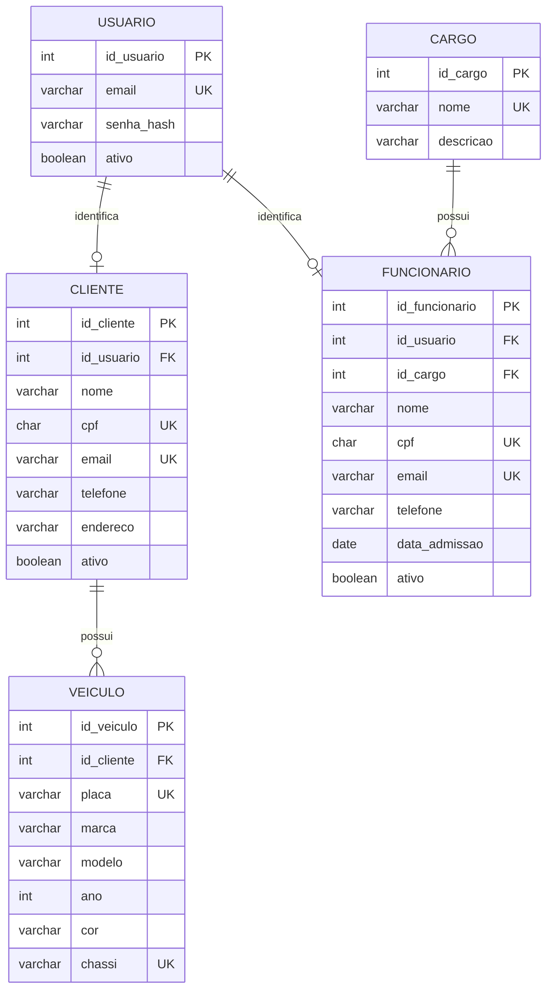

# DER do módulo

Este é o recorte necessário para DM-67 e DM-100. Ele mantém os mesmos nomes e relações centrais do DER geral enviado pelo grupo.

## Observações importantes

- `cpf` é texto, não número: pode começar com zero e não é usado em cálculos.
- `id_usuario` é nulo neste estágio para permitir consultar clientes e funcionários antes da história de login integrar as contas.
- CPF, e-mail, placa e chassi possuem restrições de unicidade.
- `LEFT JOIN` é usado na listagem de clientes para incluir clientes sem veículo.
- índices de nome, status e chaves estrangeiras ajudam as consultas do módulo.
